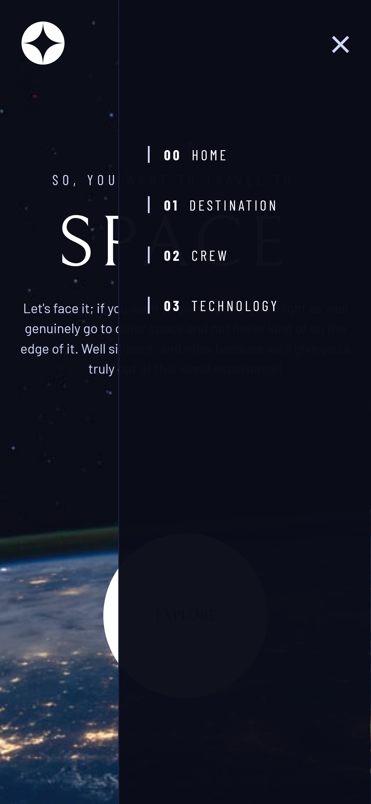

## Table of contents

- [Overview](#overview)
  - [The challenge](#the-challenge)
  - [Screenshot](#screenshot)
  - [Links](#links)
- [My process](#my-process)
  - [Built with](#built-with)
  - [What I learned](#what-i-learned)
  - [Useful resources](#useful-resources)
- [Author](#author)

## Overview

### The challenge

Some of the goals of this challenge were:

- Ensuring website is responsive to different devices
- All interactive components of the page must have hover states
- Users must be able to toggle between content in pages

### Screenshot

##### MOBILE

 

##### TABLET

##### DESKTOP

### Links

[Live Preview](https://rafaelrmb.github.io/frontend-project-space-tour/)

## My process

### Built with

This project was built using the following technologies:

- Semantic HTML5
- CSS Flexbox and Grid
- CSS custom properties and utility classes
- JavaScript
- Mobile-first workflow

### What I learned

During the completion of this challenge, some of the skills I was able to obtain were:

- Using the fetch API to load json files into the HTML with DOM manipulation
- Building flexible and responsive layouts by using CSS Grid and Flexbox
- Creating CSS custom properties and utilities classes
- Ensuring pages are accessible by using aria attributes
- Using @supports to ensure all code is loaded properly depending on browser support

### Useful resources

- [Modern CSS Reset by Piccalilli](https://piccalil.li/blog/a-modern-css-reset/)
- [CSS @supports mdn web docs](https://developer.mozilla.org/en-US/docs/Web/CSS/@supports)
- [Fetch and Display JSON Data in HTML](https://howtocreateapps.com/fetch-and-display-json-html-javascript/)
- [ARIA attributes mdn web docs](https://developer.mozilla.org/en-US/docs/Web/Accessibility/ARIA)
- [tabindex attribute mdn web docs](https://developer.mozilla.org/en-US/docs/Web/HTML/Global_attributes/tabindex)

## Author

- Frontend Mentor - [@rafaelrmb](https://www.frontendmentor.io/profile/rafaelrmb)
